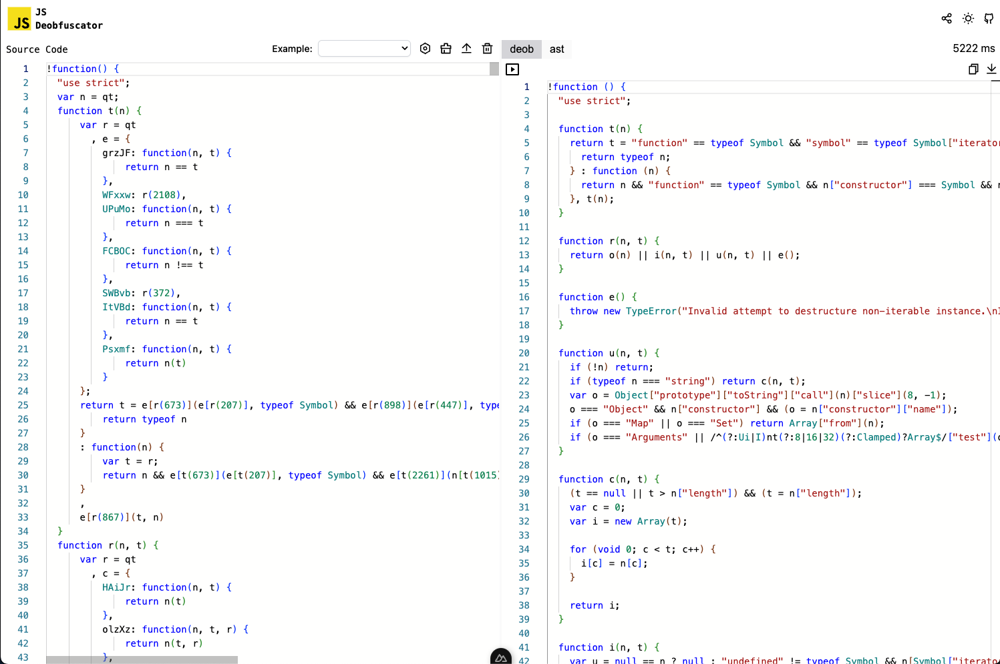
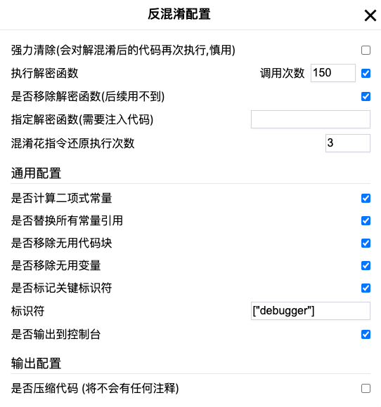
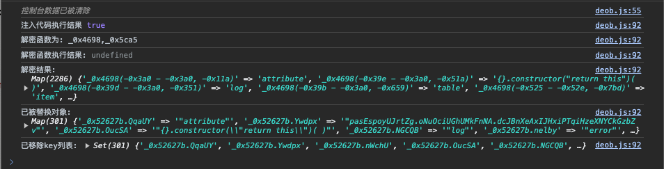

## JS代码混淆还原

让混淆不再成为逆向分析中的绊脚石

## 使用

### 网页

[js-de-obfuscator.vercel.app](https://js-de-obfuscator.vercel.app/) 或 [js-de-obfuscator.kuizuo.cn](https://js-de-obfuscator.kuizuo.cn/) 在线体验



在执行还原前，请设置相关反混淆配置



控制台可查看相关处理日志




### 本地

安装

```
git clone https://github.com/kuizuo/js-de-obfuscator
cd js-de-obfuscator
pnpm i
```

在 example 目录下存放了一些我个人遇到混淆代码实例分析，每个子目录的结构如:

```
├── xxx                           # 子目录
│   ├── index.js                  # 运行代码
│   ├── code.js                   # 需要反混淆代码
│   ├── code_1.js                 # 记录反混淆过程代码 1
│   ├── code_2.js                 # 记录反混淆过程代码 2
│   ├── pretty.js                 # 可选, 用作美化对比
│   ├── output.js                 # 最终处理完成的结果
│   ├── evalCode.js               # 代注入执行代码
│   ├── errorCode.js              # 当替换代码导致语法错误, 则将错误代码输出到该文件
```

> 切记按照要求上述文件名格式, 否则会触发 eslint 格式化。

node index.js 即可开始还原代码


## 致谢

- [反爬虫 AST 原理与还原混淆实战](https://book.douban.com/subject/35575838/)
- [sxzz/ast-explorer](https://github.com/sxzz/ast-explorer)

